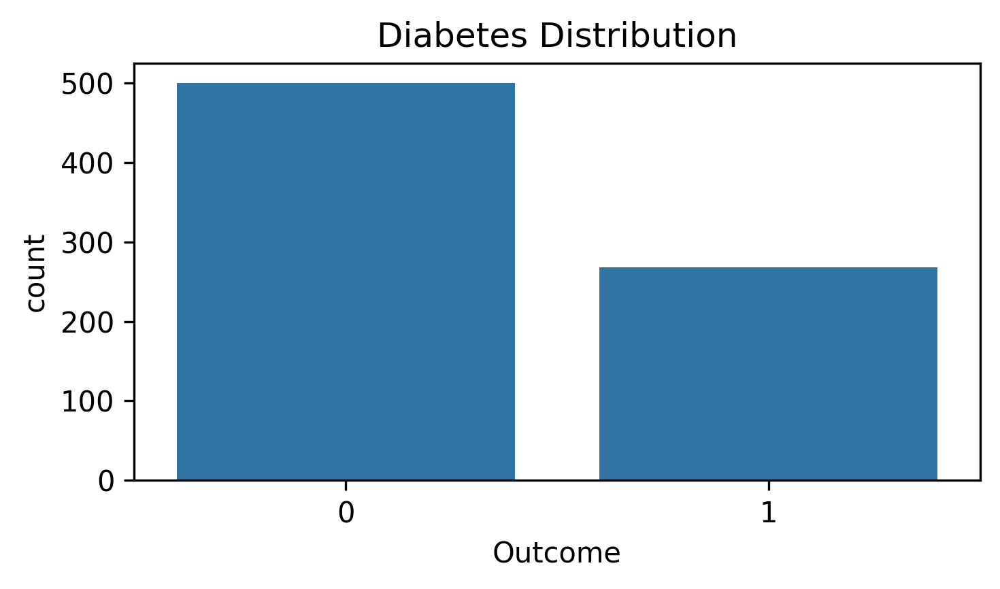
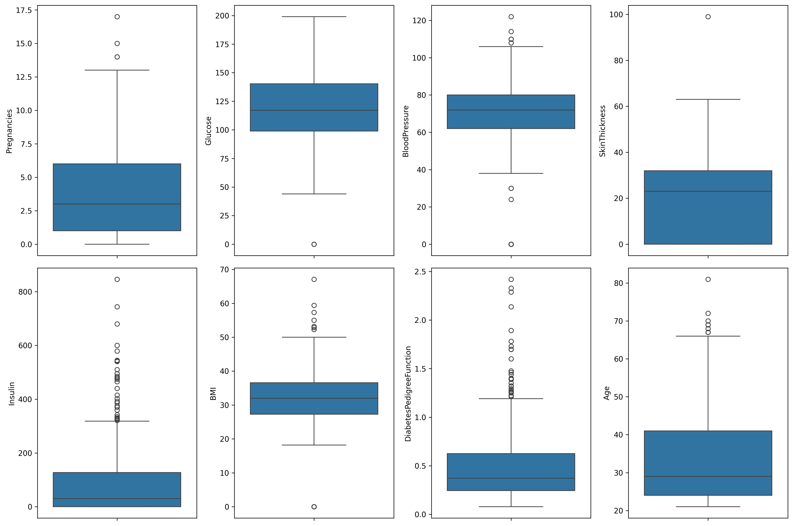
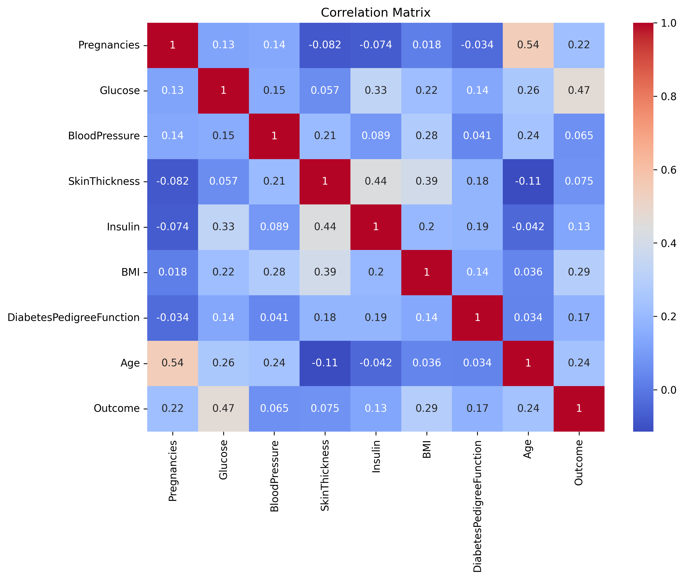
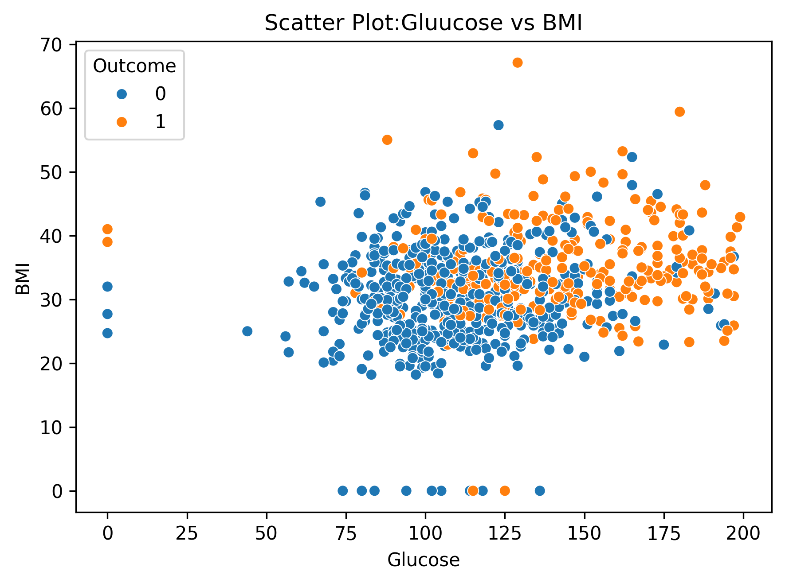

# Experiment 1: Exploratory Data Analysis (EDA) & Data Quality Assessment

## 📌 Experiment Overview
The goal of **Experiment 1** is to perform a comprehensive **Exploratory Data Analysis (EDA)** on the Pima Indians Diabetes Dataset. This involves inspecting data types, analyzing basic summary statistics, identifying missing/invalid zero values, performing Interquartile Range (IQR) outlier detection, and visualizing feature distributions and correlations.

---

## 📑 Dataset Details

- **Dataset Name**: Pima Indians Diabetes Dataset (`diabetes.csv`)
- **Dataset Location**: Root directory (`../diabetes.csv`)
- **Total Records (Rows)**: 768
- **Total Features (Columns)**: 9 (8 numeric predictor variables + 1 binary target variable)

### Feature Descriptions & Types

| Feature Name | Data Type | Attribute Description | Valid Range / Notes |
| :--- | :--- | :--- | :--- |
| **Pregnancies** | Numerical (int64) | Number of times pregnant | 0 to 17 |
| **Glucose** | Numerical (int64) | Plasma glucose concentration (2 hours in an oral glucose tolerance test) | 0 to 199 (0 is missing/invalid) |
| **BloodPressure** | Numerical (int64) | Diastolic blood pressure (mm Hg) | 0 to 122 (0 is missing/invalid) |
| **SkinThickness** | Numerical (int64) | Triceps skin fold thickness (mm) | 0 to 99 (0 is missing/invalid) |
| **Insulin** | Numerical (int64) | 2-Hour serum insulin (mu U/ml) | 0 to 846 (0 is missing/invalid) |
| **BMI** | Numerical (float64)| Body mass index (weight in kg / (height in m)²) | 0.0 to 67.1 (0 is missing/invalid) |
| **DiabetesPedigreeFunction** | Numerical (float64)| Diabetes pedigree function (genetic score) | 0.078 to 2.42 |
| **Age** | Numerical (int64) | Age in years | 21 to 81 |
| **Outcome** | Binary (int64) | Class variable (0: Non-Diabetic, 1: Diabetic) | 0 or 1 |

---

## 🛠️ Step-by-Step Instructions to Run the Program

### Prerequisites
Make sure Python 3.8+ and the following packages are installed:
```bash
pip install pandas numpy matplotlib seaborn jupyter
```

### Steps to Run
1. Open terminal / command prompt and navigate to the `Experiment 1` folder:
   ```bash
   cd "Experiment 1"
   ```
2. Start Jupyter Notebook:
   ```bash
   jupyter notebook Exp1.ipynb
   ```
3. Alternatively, open `Exp1.ipynb` in **VS Code** (with Python & Jupyter extensions) or upload to **Google Colab**.
4. Run all cells sequentially from top to bottom (`Cell` -> `Run All`).

---

## 📊 Key Findings & Output Summary

1. **Missing & Zero Value Analysis**:
   - Standard `df.isnull().sum()` reports 0 missing values because missing physiological measurements are recorded as `0`.
   - `(df == 0).sum()` reveals invalid zeros in physiological attributes:
     - `Glucose`: 5 zeros
     - `BloodPressure`: 35 zeros
     - `SkinThickness`: 227 zeros
     - `Insulin`: 374 zeros
     - `BMI`: 11 zeros
2. **Outlier Detection via IQR**:
   - Outliers are identified using:
     $$\text{IQR} = Q_3 - Q_1$$
     $$\text{Lower Limit} = Q_1 - 1.5 \times \text{IQR}, \quad \text{Upper Limit} = Q_3 + 1.5 \times \text{IQR}$$
   - Features like `Insulin` and `DiabetesPedigreeFunction` show significant upper-bound outliers.
3. **Correlation Analysis**:
   - `Glucose` shows the strongest positive correlation with the target variable `Outcome` ($\sim 0.47$).
   - `BMI` and `Age` also show notable positive correlations with diabetes occurrence.

---

## 🖼️ Output Screenshots

> [!NOTE]
> Below are placeholders for visual outputs generated by running `Exp1.ipynb`.

### 1. Target Distribution (Outcome Countplot)
*Visualizing class balance between diabetic (1) and non-diabetic (0) patients.*


*(Placeholder: Run Cell [12] in Exp1.ipynb to capture the countplot)*

---

### 2. Feature Histograms
*Distribution of all 8 physiological variables.*


*(Placeholder: Run Cell [13] in Exp1.ipynb to capture feature histograms)*

---

### 3. Outlier Boxplots
*Boxplots illustrating spread and outliers across features.*


*(Placeholder: Run Cell [14] in Exp1.ipynb to capture boxplots)*

---

### 4. Correlation Heatmap
*Heatmap representing linear correlations among dataset variables.*


*(Placeholder: Run Cell [15] in Exp1.ipynb to capture correlation heatmap)*

---

### 5. Glucose vs BMI Scatter Plot
*Scatter plot highlighting patient outcome patterns.*


*(Placeholder: Run Cell [16] in Exp1.ipynb to capture scatter plot)*

---

## 📝 How to Add Content & Output Screenshots to this README

Follow these steps to customize, update, or embed your own screenshots in this file:

### Step 1: Create an `images` Folder
Inside the `Experiment 1/` directory, create a subfolder named `images`:
```bash
mkdir images
```

### Step 2: Capture and Save Screenshots
1. Execute `Exp1.ipynb` in your Jupyter environment.
2. Right-click on any output plot generated by Matplotlib / Seaborn and select **"Save image as..."**.
3. Alternatively, export plots programmatically in code:
   ```python
   plt.savefig("images/correlation_heatmap.png", bbox_inches='tight', dpi=300)
   ```
4. Save the images with descriptive names inside the `images/` directory (e.g., `outcome_distribution.png`, `correlation_heatmap.png`).

### Step 3: Embed Screenshots in Markdown
Replace the placeholder markdown links in this `README.md` file with the path to your saved image:
```markdown

```

### Step 4: Add New Analysis / Observations
To add new text summaries or dataset insights, edit the **Key Findings & Output Summary** section above using standard markdown formatting.
