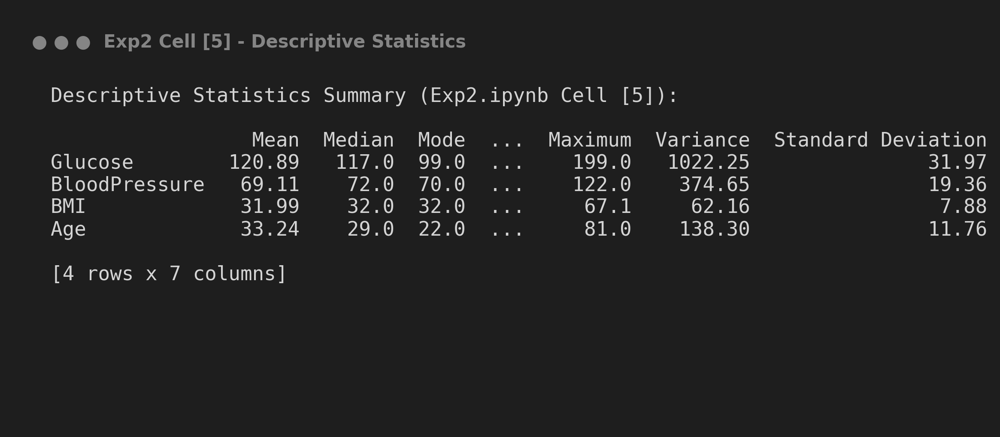
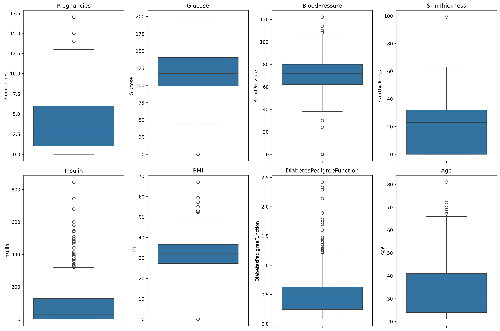
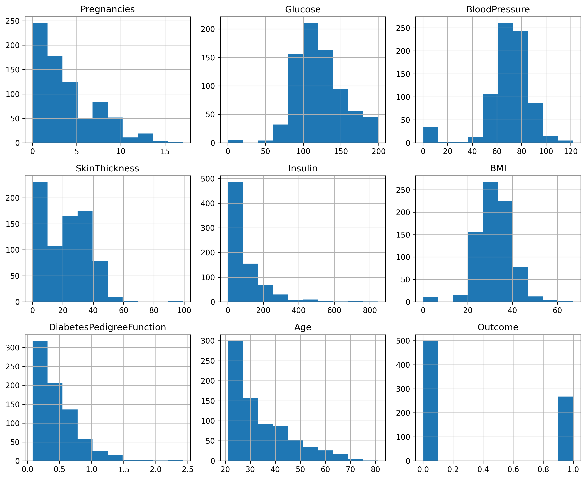
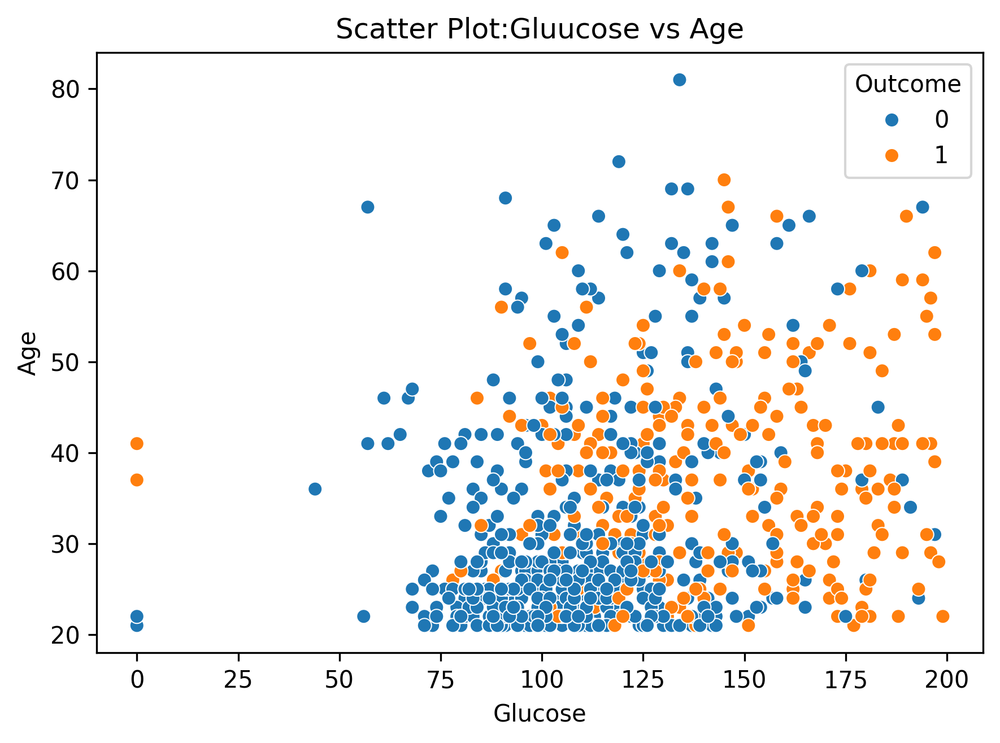

# Experiment 2: Descriptive Statistics & Data Visualization

## Experiment Overview
**Experiment 2** focuses on calculating key **Descriptive Statistics** (measures of central tendency and dispersion) for key physiological parameters in the Pima Indians Diabetes Dataset, accompanied by insightful data visual plots to understand data distributions, skewness, and feature relationships.

---

##  Dataset Details

- **Dataset Name**: Pima Indians Diabetes Dataset (`diabetes.csv`)
- **Dataset Location**: Root directory (`../diabetes.csv`)
- **Analyzed Features**: `Glucose`, `BloodPressure`, `BMI`, `Age`, and target `Outcome`.

### Feature Attribute Summary

| Feature Name | Type | Description | Unit / Scale |
| :--- | :--- | :--- | :--- |
| **Glucose** | Numerical | 2-Hour plasma glucose concentration | mg/dL |
| **BloodPressure** | Numerical | Diastolic blood pressure | mm Hg |
| **BMI** | Numerical | Body mass index | kg/m² |
| **Age** | Numerical | Age of patient | Years |
| **Outcome** | Binary | Diabetes classification (0: Negative, 1: Positive) | 0 or 1 |

---

## Step-by-Step Instructions to Run the Program

### Prerequisites
Install required Python libraries:
```bash
pip install pandas numpy matplotlib seaborn jupyter
```

### Execution Steps
1. Navigate to the `Experiment 2` directory:
   ```bash
   cd "Experiment 2"
   ```
2. Launch Jupyter Notebook:
   ```bash
   jupyter notebook Exp2.ipynb
   ```
3. Open `Exp2.ipynb` and execute all cells (`Cell` -> `Run All`).

---

## Key Findings & Descriptive Statistics Summary

### Summary Statistics Table (Extracted from Notebook Cell [5])

| Feature | Mean | Median | Mode | Minimum | Maximum | Variance | Std Dev |
| :--- | :---: | :---: | :---: | :---: | :---: | :---: | :---: |
| **Glucose** | 120.89 | 117.00 | 99.00 | 0.00 | 199.00 | 1022.25 | 31.97 |
| **BloodPressure** | 69.11 | 72.00 | 70.00 | 0.00 | 122.00 | 374.16 | 19.36 |
| **BMI** | 31.99 | 32.00 | 32.00 | 0.00 | 67.10 | 62.16 | 7.88 |
| **Age** | 33.24 | 29.00 | 22.00 | 21.00 | 81.00 | 138.30 | 11.76 |

### Statistical Insights:
- **Glucose**: Shows a symmetric distribution centered near ~120 mg/dL with high variance (1022.25).
- **Age**: Positively right-skewed with a median of 29 years and mean of 33.24 years.
- **BMI**: Near-normal bell distribution centered around 32.0 kg/m².

---

## Output 

### 1. Descriptive Statistics Output Printout
*Output generated by running Cell [5] in Exp2.ipynb*



---

### 2. Feature Boxplots
*Output generated by running Cell [6] in Exp2.ipynb*



---

### 3. Feature Histograms
*Output generated by running Cell [7] in Exp2.ipynb*



---

### 4. Scatter Plot: Glucose vs Age
*Output generated by running Cell [10] in Exp2.ipynb*




