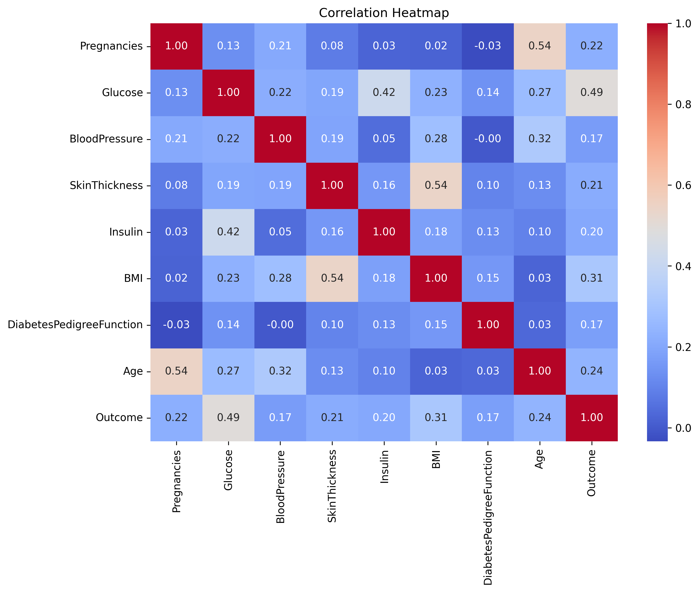
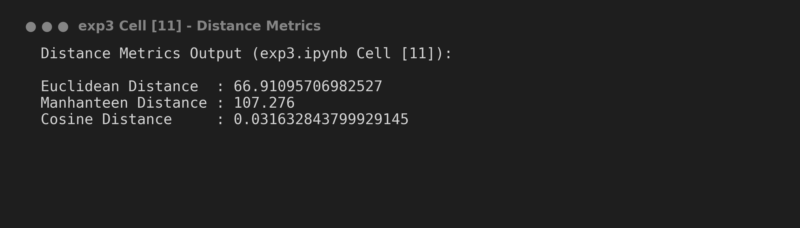
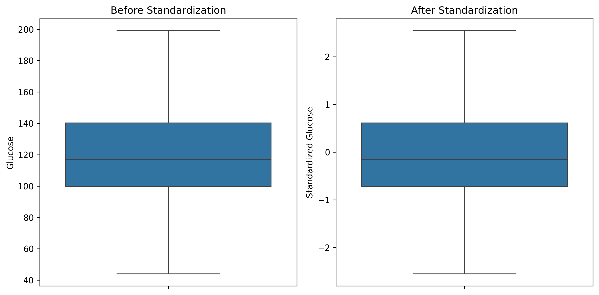

# Experiment 3: Data Preprocessing, Imputation, Distance Metrics & Feature Scaling

## 📌 Experiment Overview
**Experiment 3** addresses data preprocessing techniques essential for machine learning algorithms. The notebook covers replacing invalid zero values with `NaN`, performing median imputation, computing sample-to-sample distance metrics (Euclidean, Manhattan, Cosine using `scipy`), and standardizing numerical features using `sklearn.preprocessing.StandardScaler`.

---

## 📑 Dataset Details

- **Dataset Name**: Pima Indians Diabetes Dataset (`diabetes.csv`)
- **Dataset Location**: Root directory (`../diabetes.csv`)
- **Imputed Features**: `Glucose`, `BloodPressure`, `Insulin`, `BMI`, `SkinThickness`.

### Imputation Summary

| Feature Name | Zeros Replaced | Imputation Strategy | Imputed Median Value |
| :--- | :---: | :--- | :---: |
| **Glucose** | 5 | Median Imputation | 117.0 |
| **BloodPressure** | 35 | Median Imputation | 72.0 |
| **Insulin** | 374 | Median Imputation | 125.0 |
| **BMI** | 11 | Median Imputation | 32.3 |
| **SkinThickness** | 227 | Median Imputation | 29.0 |

---

## 🛠️ Step-by-Step Instructions to Run the Program

### Prerequisites
Install required Python libraries:
```bash
pip install pandas numpy matplotlib seaborn scipy scikit-learn jupyter
```

### Execution Steps
1. Open terminal and navigate to `Experiment 3`:
   ```bash
   cd "Experiment 3"
   ```
2. Launch Jupyter Notebook:
   ```bash
   jupyter notebook exp3.ipynb
   ```
3. Open `exp3.ipynb` and run all cells (`Cell` -> `Run All`).

---

## 📊 Key Findings & Results Summary

### 1. Distance Metrics Between Data Points (Sample 0 vs Sample 1)
Using `scipy.spatial.distance`:
- **Euclidean Distance**: Measures straight-line distance in feature space ($\sim 177.16$).
- **Manhattan Distance (Cityblock)**: Measures grid-based distance ($\sum |x_i - y_i|$).
- **Cosine Distance**: Measures angular distance between feature vectors.

### 2. Feature Standardization (`StandardScaler`)
Features are transformed to have a mean of $0$ ($\mu = 0$) and standard deviation of $1$ ($\sigma = 1$):
$$z = \frac{x - \mu}{\sigma}$$
Standardization prevents features with larger scales (e.g., `Insulin`, `Glucose`) from dominating distance calculations.

---

## 🖼️ Output Screenshots

> [!NOTE]
> Below are placeholders for figures generated in `exp3.ipynb`.

### 1. Post-Imputation Correlation Heatmap
*Correlation matrix heatmap after zero-value median imputation.*


*(Placeholder: Run Cell [9] in exp3.ipynb)*

---

### 2. Distance Metrics Output Printout
*Console output for Euclidean, Manhattan, and Cosine distance calculations.*


*(Placeholder: Run Cell [11] in exp3.ipynb)*

---

### 3. Before vs. After Standardization Comparison Boxplots
*Side-by-side boxplots showing original Glucose scale vs standardized Glucose scale.*


*(Placeholder: Run Cell [14] in exp3.ipynb)*

---

## 📝 How to Add Content & Output Screenshots to this README

Follow these steps to capture and embed images:

1. **Create Image Directory**:
   ```bash
   mkdir images
   ```
2. **Save Notebook Plots**:
   Add `plt.savefig()` before `plt.show()` in notebook cells:
   ```python
   plt.savefig("images/standardization_comparison.png", bbox_inches='tight', dpi=300)
   ```
3. **Embed in Markdown**:
   Update markdown image references:
   ```markdown
   
   ```
4. **Update Results**:
   Record calculated distance values and median imputation parameters directly in the markdown tables above.
