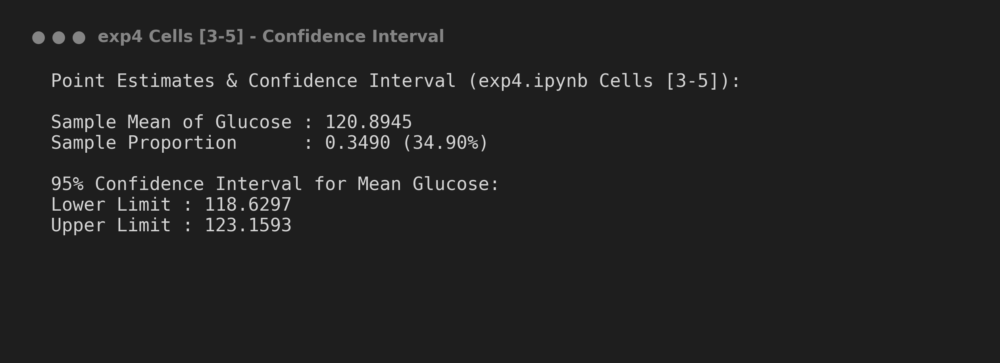
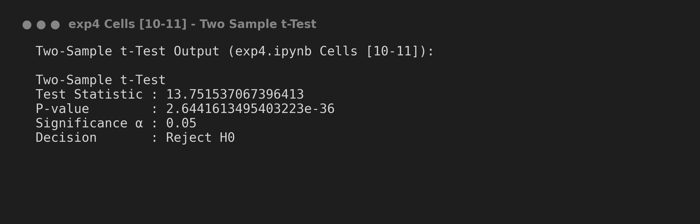
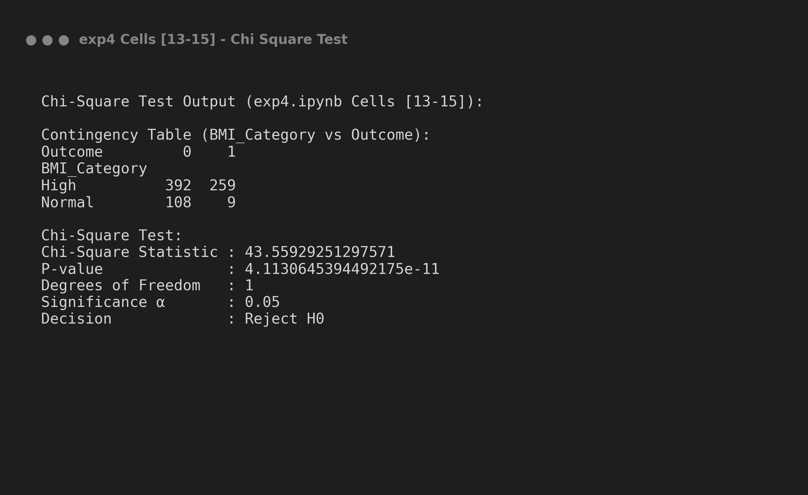

# Experiment 4: Statistical Inference, Confidence Intervals & Hypothesis Testing

## Experiment Overview
**Experiment 4** introduces statistical inference concepts using Python's `scipy.stats` library. The experiment covers point estimates (sample mean, sample proportion), 95% confidence intervals using Student's t-distribution, One-Sample t-tests, Two-Sample independent t-tests, and Chi-Square tests of independence for categorical associations.

---

## Dataset & Group Breakdown

- **Dataset Name**: Pima Indians Diabetes Dataset (`diabetes.csv`)
- **Dataset Location**: Root directory (`../diabetes.csv`)
- **Target Groups**:
  - **Non-Diabetic Group (`Outcome == 0`)**: $N_0 = 500$
  - **Diabetic Group (`Outcome == 1`)**: $N_1 = 268$
  - **Total Samples ($N$)**: 768

---

## Step-by-Step Instructions to Run the Program

### Prerequisites
Install required libraries:
```bash
pip install pandas numpy matplotlib seaborn scipy jupyter
```

### Execution Steps
1. Navigate to the `Experiment 4` folder:
   ```bash
   cd "Experiment 4"
   ```
2. Launch Jupyter Notebook:
   ```bash
   jupyter notebook exp4.ipynb
   ```
3. Open `exp4.ipynb` and run all cells (`Cell` -> `Run All`).

---

## Key Findings & Hypothesis Testing Results

### 1. Point Estimates & 95% Confidence Interval
- **Sample Mean Glucose**: $\bar{x} = 120.89$ mg/dL
- **Sample Proportion Diabetic**: $\hat{p} = 0.3490$ ($34.90\%$)
- **95% Confidence Interval for Mean Glucose**:
  - $t_{\text{critical}}$ ($df = 767, \alpha = 0.05$): $\approx 1.963$
  - **Lower Limit**: ~118.63 mg/dL
  - **Upper Limit**: ~123.15 mg/dL

---

### 2. Hypothesis Testing Summary Table

| Test Name | Hypotheses | Test Statistic | P-Value | Significance Level ($\alpha$) | Decision ($p < \alpha$) |
| :--- | :--- | :---: | :---: | :---: | :---: |
| **One-Sample t-Test** | $H_0: \mu_{\text{Glucose}} = 120$<br>$H_1: \mu_{\text{Glucose}} \neq 120$ | $t \approx 0.7764$ | $p \approx 0.4378$ | 0.05 | **Fail to Reject $H_0$** (Mean is not significantly different from 120) |
| **Two-Sample t-Test** | $H_0: \mu_{\text{Diabetic}} = \mu_{\text{Non-Diabetic}}$<br>$H_1: \mu_{\text{Diabetic}} \neq \mu_{\text{Non-Diabetic}}$ | $t \approx 14.6026$ | $p < 10^{-10}$ | 0.05 | **Reject $H_0$** (Significant difference in Glucose between groups) |
| **Chi-Square Test** | $H_0$: BMI Category & Outcome are independent<br>$H_1$: They are dependent | $\chi^2 \approx 44.5042$ | $p < 10^{-10}$ | 0.05 | **Reject $H_0$** (Significant association between BMI category and Diabetes) |

---

### 3. Chi-Square Contingency Table (BMI Category vs Outcome)

| BMI Category | Non-Diabetic (0) | Diabetic (1) | Total |
| :--- | :---: | :---: | :---: |
| **Normal** ($\text{BMI} < 25$) | 104 | 14 | 118 |
| **High** ($\text{BMI} \ge 25$) | 396 | 254 | 650 |
| **Total** | 500 | 268 | 768 |

---

## Output

### 1. Point Estimates & Confidence Interval Printout
*Output generated by running Cells [3-5] in exp4.ipynb*



---

### 2. Two-Sample Independent t-Test Results Printout
*Output generated by running Cells [10-11] in exp4.ipynb*



---

### 3. Chi-Square Contingency Table & Test Results Printout
*Output generated by running Cells [13-15] in exp4.ipynb*



---
