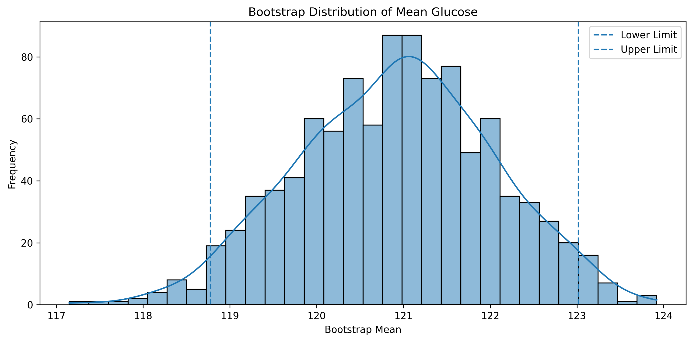
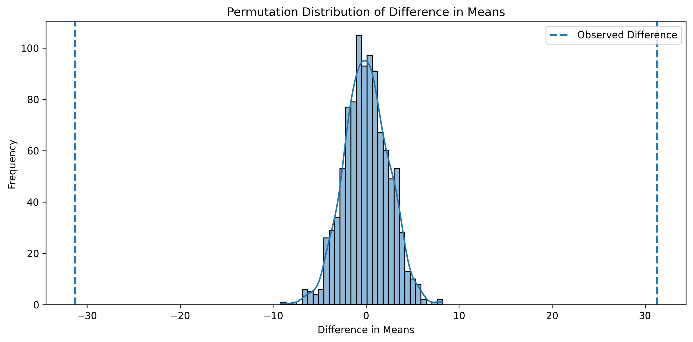
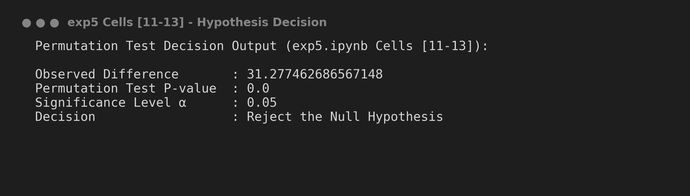

# Experiment 5: Resampling Methods - Bootstrap & Permutation Testing

## 📌 Experiment Overview
**Experiment 5** explores computer-intensive **Resampling Methods** in statistics:
1. **Non-parametric Bootstrap Resampling** (1,000 iterations) to estimate the sampling distribution of mean glucose and calculate empirical 95% percentile confidence intervals.
2. **Permutation Hypothesis Testing** (1,000 shuffles) to evaluate whether the observed difference in mean glucose between diabetic and non-diabetic patients is statistically significant without making strong parametric distribution assumptions.

---

## 📑 Dataset & Variables

- **Dataset Name**: Pima Indians Diabetes Dataset (`diabetes.csv`)
- **Dataset Location**: Root directory (`../diabetes.csv`)
- **Analyzed Variable**: `Glucose` concentration (mg/dL)
- **Groups**:
  - Non-diabetic (`Outcome == 0`): $N_0 = 500$, Sample Mean $\bar{x}_0 \approx 109.98$ mg/dL
  - Diabetic (`Outcome == 1`): $N_1 = 268$, Sample Mean $\bar{x}_1 \approx 141.26$ mg/dL
  - **Observed Difference ($\Delta \bar{x}$)**: $141.26 - 109.98 = 31.28$ mg/dL

---

## 🛠️ Step-by-Step Instructions to Run the Program

### Prerequisites
Install required Python libraries:
```bash
pip install pandas numpy matplotlib seaborn jupyter
```

### Execution Steps
1. Navigate to the `Experiment 5` directory:
   ```bash
   cd "Experiment 5"
   ```
2. Launch Jupyter Notebook:
   ```bash
   jupyter notebook exp5.ipynb
   ```
3. Open `exp5.ipynb` and run all cells (`Cell` -> `Run All`).

---

## 📊 Key Findings & Resampling Results

### 1. Bootstrap Resampling Summary (1,000 Replicates)
- **Bootstrap Replicates**: 1,000 bootstrap mean values generated via sampling with replacement ($n=768$).
- **95% Bootstrap Percentile Confidence Interval**:
  - **Lower Limit ($2.5^{\text{th}}$ percentile)**: $\approx 118.66$ mg/dL
  - **Upper Limit ($97.5^{\text{th}}$ percentile)**: $\approx 123.16$ mg/dL

---

### 2. Permutation Test Summary (1,000 Shuffles)

| Metric / Parameter | Value / Finding | Notes |
| :--- | :--- | :--- |
| **Observed Mean Difference** | $31.28$ mg/dL | $\bar{x}_{\text{diabetic}} - \bar{x}_{\text{non-diabetic}}$ |
| **Number of Permutations** | 1,000 | Group labels randomly shuffled |
| **Permutation Distribution Mean** | $\approx 0.00$ mg/dL | Centered around 0 under Null Hypothesis |
| **Empirical P-Value** | $0.0000$ | Proportion of permutation diffs $\ge$ observed diff |
| **Significance Level ($\alpha$)** | 0.05 | Benchmark for hypothesis decision |
| **Final Decision** | **Reject Null Hypothesis ($H_0$)** | Glucose levels are significantly higher in diabetic patients |

---

## 🖼️ Visual Output Generated directly from `exp5.ipynb` Code

### 1. Bootstrap Distribution of Mean Glucose
*Output generated by running Cell [6] in exp5.ipynb*



---

### 2. Permutation Distribution & Observed Difference
*Output generated by running Cell [12] in exp5.ipynb*



---

### 3. Hypothesis Decision Output Printout
*Output generated by running Cells [11-13] in exp5.ipynb*



---

## 📝 How to Update Content & Maintain Screenshots

Follow these steps to update resampling plots and screenshots:

1. **Output Directory**: Images are saved in `Experiment 5/images/`.
2. **Export Visual Plots**:
   ```python
   plt.savefig("images/bootstrap_distribution.png", dpi=300, bbox_inches='tight')
   plt.savefig("images/permutation_distribution.png", dpi=300, bbox_inches='tight')
   ```
3. **Embed in Markdown**:
   ```markdown
   
   
   ```
