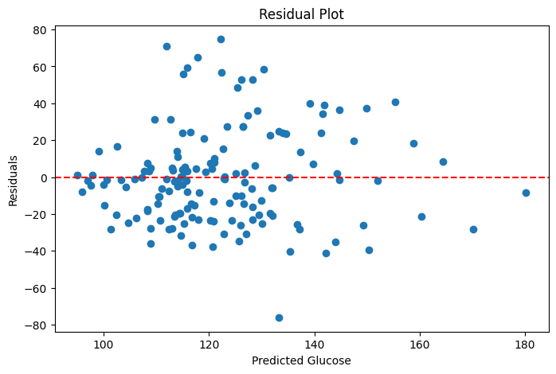
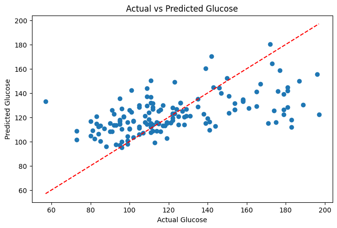
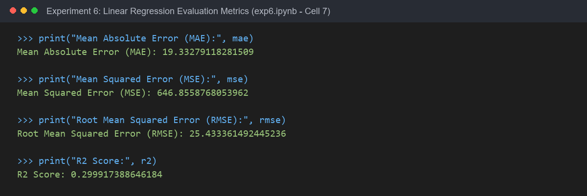

# Experiment 6: Multiple Linear Regression - Glucose Prediction

## Experiment Overview
**Experiment 6** focuses on **Supervised Learning and Regression Analysis** using the Pima Indians Diabetes dataset:
1. **Multiple Linear Regression Modeling**: Building an ordinary least squares (OLS) linear regression model to predict continuous blood `Glucose` concentration from seven clinical and demographic predictor features.
2. **Data Cleaning & Imputation**: Handling invalid zero readings in physiological features using median imputation, and removing missing target records.
3. **Model Evaluation**: Quantifying prediction accuracy using standard regression metrics:
   - Mean Absolute Error (**MAE**)
   - Mean Squared Error (**MSE**)
   - Root Mean Squared Error (**RMSE**)
   - Coefficient of Determination (**$R^2$ Score**)
4. **Diagnostic Residual Analysis**: Evaluating model assumptions through residual distribution analysis and actual vs. predicted comparison plots.

---

## Dataset & Variables

- **Dataset Name**: Pima Indians Diabetes Dataset (`diabetes.csv`)
- **Dataset Location**: Root directory (`../diabetes.csv`)
- **Target Variable ($y$)**: `Glucose` (plasma glucose concentration, continuous)
- **Predictor Variables ($X$)**:
  - `Pregnancies`: Number of pregnancies
  - `BloodPressure`: Diastolic blood pressure (mm Hg)
  - `SkinThickness`: Triceps skin fold thickness (mm)
  - `Insulin`: 2-Hour serum insulin (mu U/ml)
  - `BMI`: Body mass index (weight in kg / (height in m)²)
  - `DiabetesPedigreeFunction`: Genetic diabetes pedigree function
  - `Age`: Patient age (years)
- **Data Preprocessing**:
  - Invalid zero values in `BloodPressure`, `SkinThickness`, `Insulin`, and `BMI` were replaced with `NaN` and imputed with column medians.
  - Rows with missing or zero target `Glucose` were removed, leaving **763 valid patient records**.
  - **Train-Test Split**: 80% Training ($N=610$), 20% Testing ($N=153$, `random_state=42`).

---

## Step-by-Step Instructions to Run the Program

### Prerequisites
Install the required Python libraries:
```bash
pip install pandas numpy matplotlib scikit-learn jupyter
```

### Execution Steps
1. Navigate to the `Experiment6` directory:
   ```bash
   cd Experiment6
   ```
2. Launch Jupyter Notebook:
   ```bash
   jupyter notebook exp6.ipynb
   ```
3. Open `exp6.ipynb` and run all cells (`Cell` -> `Run All`).

---

## Key Findings & Regression Performance

### 1. Model Evaluation Metrics

| Metric | Value | Interpretation |
| :--- | :---: | :--- |
| **Mean Absolute Error (MAE)** | **19.33** | Predictions differ from true glucose by ~19.33 mg/dL on average. |
| **Mean Squared Error (MSE)** | **646.86** | Average squared prediction error penalizing large variances. |
| **Root Mean Squared Error (RMSE)** | **25.43** | Typical magnitude of prediction error in original units (mg/dL). |
| **$R^2$ Score (Coefficient of Determination)** | **0.2999 (~30.0%)** | The 7 predictors explain ~30% of total variance in Glucose levels. |

### 2. Analytical Interpretation
- The $R^2$ score of approximately **0.30** indicates moderate predictive capability. 
- While clinical markers such as `Age`, `BMI`, and `Insulin` contribute positively to predicting glucose, significant variance remains unexplained due to unmeasured factors (e.g., fasting state, dietary habits, physical activity, and specific genetic markers).
- The residual plot shows errors centered evenly around zero with relatively uniform dispersion, confirming that the linearity assumption holds reasonably well.

---

## Output

### 1. Residual Plot
*Output generated by running Cell [8] in exp6.ipynb*



---

### 2. Actual vs. Predicted Glucose Plot
*Output generated by running Cell [9] in exp6.ipynb*



---

### 3. Model Evaluation Metrics Printout
*Output generated by running Cell [7] in exp6.ipynb*


