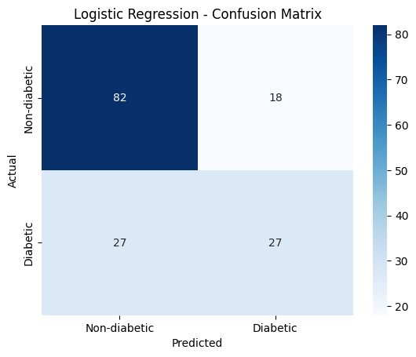
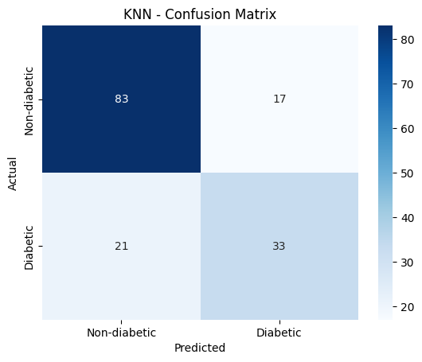
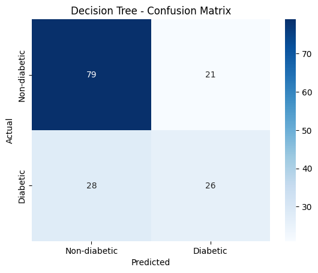
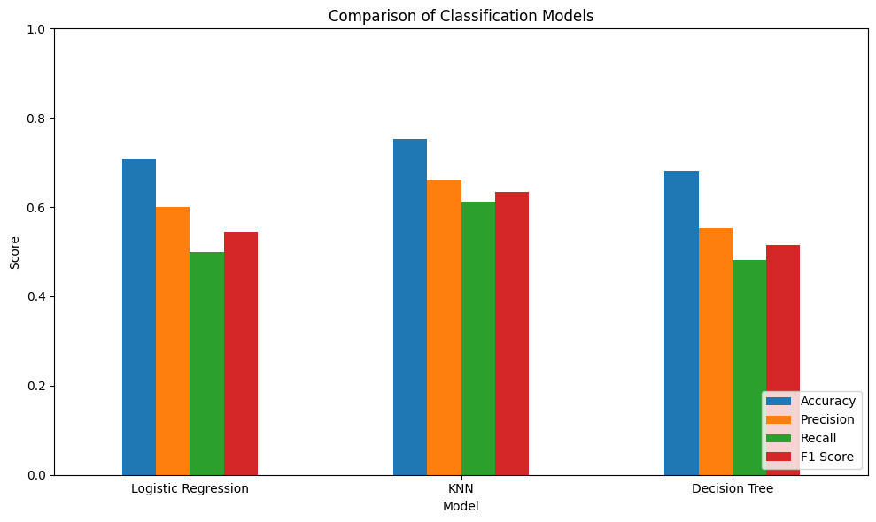
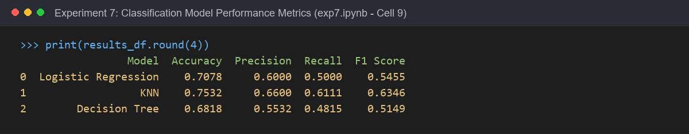

# Experiment 7: Supervised Classification & Performance Evaluation

## Experiment Overview
**Experiment 7** explores **Supervised Classification Models** and comparative performance diagnostics:
1. **Three Core Classification Algorithms**:
   - **Logistic Regression**: Linear probabilistic decision boundary classifier.
   - **K-Nearest Neighbors (KNN, $k=5$)**: Distance-based non-parametric instance learner.
   - **Decision Tree Classifier**: Hierarchical rule-based tree model.
2. **Robust Scikit-Learn Pipelines**: Seamless data preprocessing integrating `SimpleImputer(strategy='median')` and `StandardScaler()` to prevent data leakage.
3. **Comprehensive Metric Diagnostics**: Evaluating model effectiveness on an unseen test cohort using:
   - **Confusion Matrix** (True Positives, True Negatives, False Positives, False Negatives)
   - **Classification Accuracy**
   - **Precision**
   - **Recall (Sensitivity)**
   - **F1-Score** (harmonic mean of Precision and Recall)

---

## Dataset & Variables

- **Dataset Name**: Pima Indians Diabetes Dataset (`diabetes.csv`)
- **Dataset Location**: Root directory (`../diabetes.csv`)
- **Target Variable ($y$)**: `Outcome`
  - `0`: Non-diabetic ($N=500, 65.1\%$)
  - `1`: Diabetic ($N=268, 34.9\%$)
- **Input Features ($X$)**:
  - `Pregnancies`, `Glucose`, `BloodPressure`, `SkinThickness`, `Insulin`, `BMI`, `DiabetesPedigreeFunction`, `Age`
- **Data Splitting**:
  - Stratified 80/20 train/test split:
    - **Training Set**: $N = 614$
    - **Test Set**: $N = 154$ (stratified outcome distribution)

---

## Step-by-Step Instructions to Run the Program

### Prerequisites
Install the required Python libraries:
```bash
pip install pandas numpy matplotlib seaborn scikit-learn jupyter
```

### Execution Steps
1. Navigate to the `Experiment7` directory:
   ```bash
   cd Experiment7
   ```
2. Launch Jupyter Notebook:
   ```bash
   jupyter notebook exp7.ipynb
   ```
3. Open `exp7.ipynb` and run all cells (`Cell` -> `Run All`).

---

## Key Findings & Comparative Performance

### 1. Classification Metrics Summary Table

| Model | Accuracy | Precision | Recall | F1 Score | Key Strengths / Trade-offs |
| :--- | :---: | :---: | :---: | :---: | :--- |
| **K-Nearest Neighbors (KNN)** | **0.7532 (75.3%)** | **0.6600 (66.0%)** | **0.6111 (61.1%)** | **0.6346** | **Top Performer**: Highest accuracy, precision, recall, and F1 score. |
| **Logistic Regression** | 0.7078 (70.8%) | 0.6000 (60.0%) | 0.5000 (50.0%) | 0.5455 | Balanced linear baseline; smooth probabilistic estimates. |
| **Decision Tree** | 0.6818 (68.2%) | 0.5532 (55.3%) | 0.4815 (48.1%) | 0.5149 | Highly interpretable decision boundaries; slightly prone to variance. |

---

### 2. Confusion Matrix Breakdown (Test Set, $N=154$)

| Model | True Negatives (TN) | False Positives (FP) | False Negatives (FN) | True Positives (TP) |
| :--- | :---: | :---: | :---: | :---: |
| **Logistic Regression** | 82 | 18 | 27 | 27 |
| **KNN ($k=5$)** | **83** | **17** | **21** | **33** |
| **Decision Tree** | 79 | 21 | 28 | 26 |

- **Clinical Insight**: In medical diagnosis, reducing **False Negatives** (missed diabetic patients) is of paramount importance. **KNN** achieved the highest True Positive count ($33$) and the lowest False Negative count ($21$), resulting in superior recall ($61.1\%$) and overall F1-Score ($0.6346$).

---

## Output

### 1. Logistic Regression - Confusion Matrix
*Output generated by running Cell [8] in exp7.ipynb*



---

### 2. K-Nearest Neighbors (KNN) - Confusion Matrix
*Output generated by running Cell [8] in exp7.ipynb*



---

### 3. Decision Tree - Confusion Matrix
*Output generated by running Cell [8] in exp7.ipynb*



---

### 4. Model Comparison Bar Chart
*Output generated by running Cell [10] in exp7.ipynb*



---

### 5. Classification Performance Summary Printout
*Output generated by running Cell [9] in exp7.ipynb*


