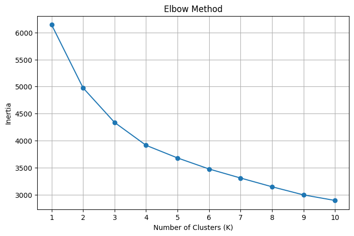
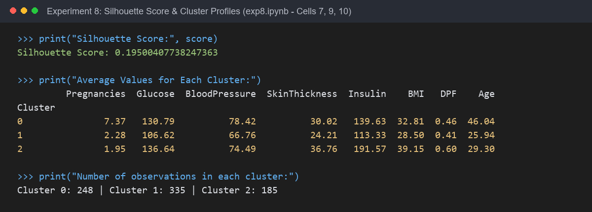

# Experiment 8: Unsupervised Learning - K-Means Clustering & PCA

## Experiment Overview
**Experiment 8** focuses on **Unsupervised Learning and Dimensionality Reduction**:
1. **Unsupervised Patient Segmentation**: Discovering natural subgroups (clusters) within the patient population using **K-Means Clustering** without relying on outcome labels.
2. **Optimal Cluster Selection**: Utilizing the **Elbow Method** across inertia values for $K \in [1, 10]$ to identify the optimal number of clusters.
3. **Cluster Quality Validation**: Measuring cluster tightness and separation using the **Silhouette Score**.
4. **Dimensionality Reduction via PCA**: Projecting the 8-dimensional standardized clinical feature space onto 2 principal components (**PCA1** and **PCA2**) for 2D visualization of cluster boundaries.
5. **Clinical Profiling**: Analyzing cluster centroids to interpret distinctive physiological profiles of each patient subgroup.

---

## Dataset & Variables

- **Dataset Name**: Pima Indians Diabetes Dataset (`diabetes.csv`)
- **Dataset Location**: Root directory (`../diabetes.csv`)
- **Feature Set ($X$)**:
  - `Pregnancies`, `Glucose`, `BloodPressure`, `SkinThickness`, `Insulin`, `BMI`, `DiabetesPedigreeFunction`, `Age`
- **Data Preprocessing Pipeline**:
  - Biological zero corrections in `Glucose`, `BloodPressure`, `SkinThickness`, `Insulin`, and `BMI` replaced with `NaN`.
  - Imputation of missing values using column medians via `SimpleImputer`.
  - Feature Standardization using `StandardScaler` to ensure all features contribute equally to Euclidean distance computations.

---

## Step-by-Step Instructions to Run the Program

### Prerequisites
Install the required Python libraries:
```bash
pip install pandas numpy matplotlib seaborn scikit-learn jupyter
```

### Execution Steps
1. Navigate to the `Experiment8` directory:
   ```bash
   cd Experiment8
   ```
2. Launch Jupyter Notebook:
   ```bash
   jupyter notebook exp8.ipynb
   ```
3. Open `exp8.ipynb` and run all cells (`Cell` -> `Run All`).

---

## Key Findings & Cluster Profiles

### 1. Optimal Clustering Parameters
- **Chosen $K$**: **3 Clusters** (elbow inflection point observed between $K=2$ and $K=4$).
- **Overall Silhouette Score**: **0.1950** (indicates meaningful cluster structure across continuous physiological distributions).

### 2. Cluster Profiles & Centroids Summary

| Attribute | Cluster 0 ($N=248$) | Cluster 1 ($N=335$) | Cluster 2 ($N=185$) |
| :--- | :---: | :---: | :---: |
| **Pregnancies** | **7.37** | 2.28 | 1.95 |
| **Glucose (mg/dL)** | 130.79 | **106.62** (Lowest) | **136.64** (Highest) |
| **BloodPressure (mm Hg)** | **78.42** | 66.76 | 74.49 |
| **SkinThickness (mm)** | 30.02 | 24.21 | **36.76** |
| **Insulin ($\mu\text{U/ml}$)** | 139.63 | 113.33 | **191.57** (Highest) |
| **BMI ($\text{kg/m}^2$)** | 32.81 | 28.50 | **39.15** (Severe Obesity) |
| **Diabetes Pedigree Function**| 0.46 | 0.41 | **0.60** (Highest) |
| **Age (years)** | **46.04** (Oldest) | 25.94 (Youngest) | 29.30 |
| **Clinical Profile** | **Older / Multiparas Cohort** | **Young / Healthy Cohort** | **High-Risk / Metabolic Syndrome** |

### 3. Key Clinical Insights
- **Cluster 1 (Younger, Low Risk)**: Characterized by normal-range glucose, lowest BMI, lowest insulin levels, and youngest age (~26 yrs).
- **Cluster 0 (Older, Multiparous)**: Characterized by significantly higher age (~46 yrs) and pregnancy count (~7.4), with elevated blood pressure and glucose levels.
- **Cluster 2 (High Metabolic Risk)**: Characterized by severe obesity (BMI ~39.2), hyperinsulinemia (Insulin ~191.6), and elevated glucose (~136.6 mg/dL) combined with high genetic pedigree (0.60).

---

## Output

### 1. Elbow Method Line Plot
*Output generated by running Cell [5] in exp8.ipynb*



---

### 2. K-Means Clusters Visualized Using PCA
*Output generated by running Cell [8] in exp8.ipynb*


---

### 3. Silhouette Score & Cluster Profiles Printout
*Output generated by running Cells [7, 9, 10] in exp8.ipynb*


