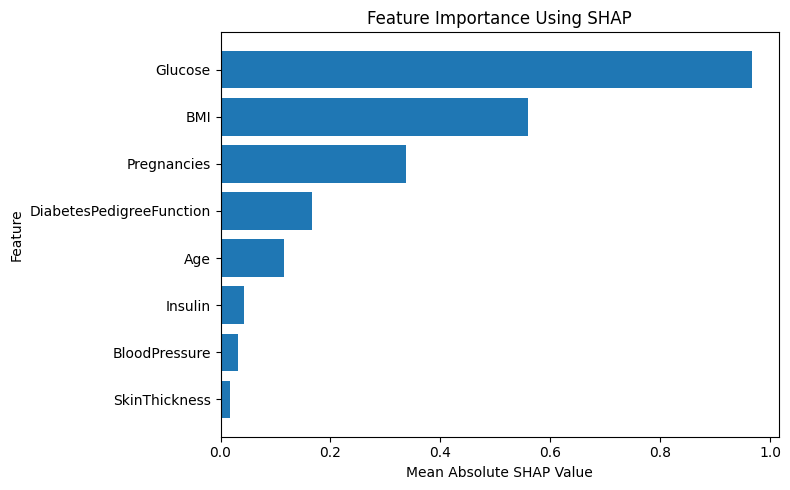
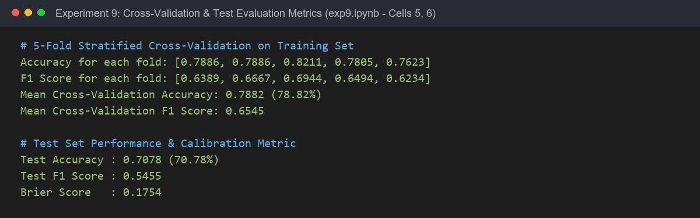

# Experiment 9: Model Calibration & Explainable AI (SHAP)

## Experiment Overview
**Experiment 9** explores advanced Machine Learning evaluation and model interpretability:
1. **Pipeline Architecture**: Constructing a leak-free pipeline incorporating `SimpleImputer(strategy='median')`, `StandardScaler()`, and `LogisticRegression(max_iter=1000)`.
2. **K-Fold Stratified Cross-Validation**: Evaluating model generalization performance across 5 randomized folds.
3. **Probability Calibration**: Measuring the reliability of predicted diagnostic probabilities using the **Calibration Curve (Reliability Diagram)** and the **Brier Score Loss**.
4. **Explainable AI with SHAP**: Leveraging **SHapley Additive exPlanations (`shap.LinearExplainer`)** from cooperative game theory to provide rigorous, unified explanations of individual and global feature importance.

---

## Dataset & Variables

- **Dataset Name**: Pima Indians Diabetes Dataset (`diabetes.csv`)
- **Dataset Location**: Root directory (`../diabetes.csv`)
- **Target Variable ($y$)**: `Outcome` (0 = Non-diabetic, 1 = Diabetic)
- **Features ($X$)**: `Pregnancies`, `Glucose`, `BloodPressure`, `SkinThickness`, `Insulin`, `BMI`, `DiabetesPedigreeFunction`, `Age`
- **Data Splitting**:
  - Stratified 80/20 train/test split:
    - **Training Set**: $N = 614$
    - **Test Set**: $N = 154$

---

## Step-by-Step Instructions to Run the Program

### Prerequisites
Install the required Python libraries:
```bash
pip install pandas numpy matplotlib scikit-learn shap jupyter
```

### Execution Steps
1. Navigate to the `Experiment9` directory:
   ```bash
   cd Experiment9
   ```
2. Launch Jupyter Notebook:
   ```bash
   jupyter notebook exp9.ipynb
   ```
3. Open `exp9.ipynb` and run all cells (`Cell` -> `Run All`).

---

## Key Findings & Interpretability Insights

### 1. Cross-Validation & Test Evaluation

| Evaluation Metric | Value | Interpretation / Context |
| :--- | :---: | :--- |
| **5-Fold CV Accuracy (Mean)** | **0.7882 (78.82%)** | Stable performance across folds: [78.9%, 78.9%, 82.1%, 78.0%, 76.2%] |
| **5-Fold CV F1 Score (Mean)** | **0.6545** | Demonstrates consistent balance between precision and recall |
| **Holdout Test Accuracy** | **0.7078 (70.78%)** | Generalization score on unseen test partition ($N=154$) |
| **Holdout Test F1 Score** | **0.5455** | Test set harmonic balance under class imbalance |
| **Brier Score Loss** | **0.1754** | Low Brier score indicating strong probability calibration |

---

### 2. SHAP Feature Importance Hierarchy

| Rank | Feature Name | Mean Absolute SHAP Value | Contribution Impact |
| :---: | :--- | :---: | :--- |
| 1 | **Glucose** | **0.9678** | Primary driver: High glucose dramatically increases diabetes likelihood. |
| 2 | **BMI** | **0.5601** | Strong positive impact: Higher BMI significantly increases risk. |
| 3 | **Pregnancies** | **0.3374** | Positive association with risk. |
| 4 | **DiabetesPedigreeFunction** | **0.1656** | Positive genetic risk weighting. |
| 5 | **Age** | **0.1160** | Older age modestly elevates predicted risk. |
| 6 | **Insulin** | **0.0433** | Modest secondary indicator after glucose adjustment. |
| 7 | **BloodPressure** | **0.0315** | Slight marginal effect on prediction. |
| 8 | **SkinThickness** | **0.0167** | Lowest direct predictive impact in the linear model. |

---

## Output

### 1. Calibration Curve (Reliability Diagram)
*Output generated by running Cell [7] in exp9.ipynb*


---

### 2. SHAP Summary Beeswarm Plot
*Output generated by running Cell [8] in exp9.ipynb*


---

### 3. SHAP Feature Importance Bar Chart
*Output generated by running Cell [10] in exp9.ipynb*



---

### 4. Cross-Validation & Test Metrics Printout
*Output generated by running Cells [5, 6] in exp9.ipynb*


