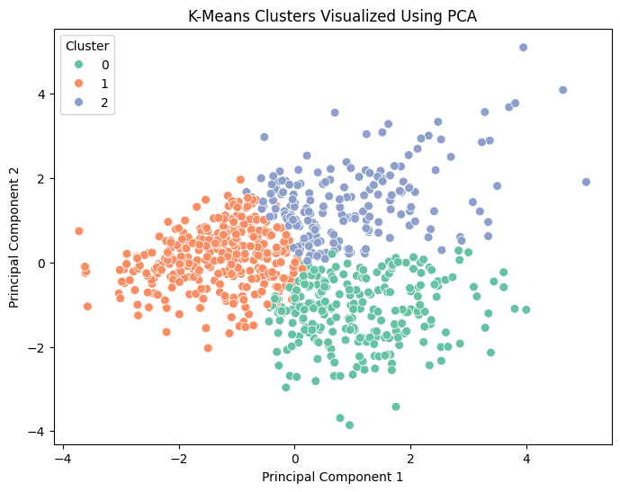
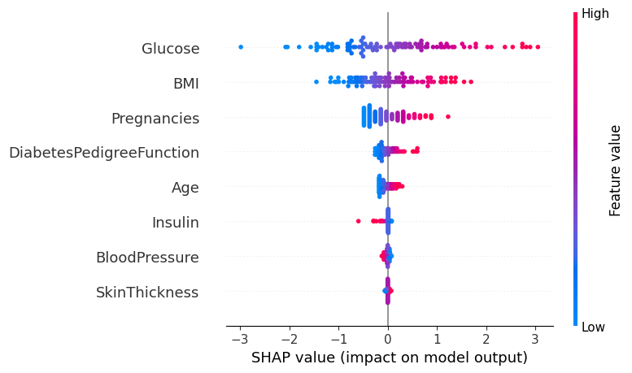
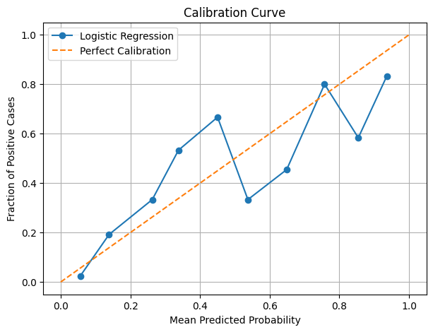

# Statistics for Machine Learning & Data Science (Stats AIDS)

Welcome to the **Statistics for Machine Learning & Data Science** repository! This repository contains a structured collection of practical experiments focused on exploratory data analysis (EDA), descriptive statistics, data preprocessing, distance metrics, feature scaling, statistical inference, hypothesis testing, resampling methods, linear regression analysis, supervised classification modeling, unsupervised K-means clustering with PCA, and model calibration with explainable AI (SHAP).

---

## Repository Structure

```directory
Statistics-for-MLandDS/
│
├── diabetes.csv                    # Pima Indians Diabetes Dataset
├── README.md                       # Main Repository Documentation (This file)
│
├── Experiment 1/                   # Experiment 1: EDA & Data Quality Assessment
│   ├── Exp1.ipynb                  # Jupyter Notebook for Experiment 1
│   ├── README.md                   # Detailed Guide for Exp 1
│   └── images/                     # Output figures (Outcome dist, Histograms, Heatmap, Scatter)
│
├── Experiment 2/                   # Experiment 2: Descriptive Statistics & Data Visualization
│   ├── Exp2.ipynb                  # Jupyter Notebook for Experiment 2
│   ├── README.md                   # Detailed Guide for Exp 2
│   └── images/                     # Output figures (Summary Table, Boxplots, Histograms)
│
├── Experiment 3/                   # Experiment 3: Data Preprocessing, Imputation & Scaling
│   ├── exp3.ipynb                  # Jupyter Notebook for Experiment 3
│   ├── README.md                   # Detailed Guide for Exp 3
│   └── images/                     # Output figures (Imputed Heatmap, Distance Metrics, Scaling)
│
├── Experiment 4/                   # Experiment 4: Statistical Inference & Hypothesis Testing
│   ├── exp4.ipynb                  # Jupyter Notebook for Experiment 4
│   ├── README.md                   # Detailed Guide for Exp 4
│   └── images/                     # Output figures (Confidence Intervals, t-Test, Chi-Square)
│
├── Experiment 5/                   # Experiment 5: Resampling Methods (Bootstrap & Permutation)
│   ├── exp5.ipynb                  # Jupyter Notebook for Experiment 5
│   ├── README.md                   # Detailed Guide for Exp 5
│   └── images/                     # Output figures (Bootstrap & Permutation Distributions)
│
├── Experiment6/                    # Experiment 6: Linear Regression Analysis
│   ├── exp6.ipynb                  # Jupyter Notebook for Experiment 6
│   ├── README.md                   # Detailed Guide for Exp 6
│   └── images/                     # Output figures (Residual Plot, Actual vs Predicted)
│
├── Experiment7/                    # Experiment 7: Supervised Classification & Model Comparison
│   ├── exp7.ipynb                  # Jupyter Notebook for Experiment 7
│   ├── README.md                   # Detailed Guide for Exp 7
│   └── images/                     # Output figures (Confusion Matrices, Model Comparison)
│
├── Experiment8/                    # Experiment 8: Unsupervised Learning (K-Means & PCA)
│   ├── exp8.ipynb                  # Jupyter Notebook for Experiment 8
│   ├── README.md                   # Detailed Guide for Exp 8
│   └── images/                     # Output figures (Elbow Method, PCA Cluster Scatter)
│
└── Experiment9/                    # Experiment 9: Model Calibration & Explainable AI (SHAP)
    ├── exp9.ipynb                  # Jupyter Notebook for Experiment 9
    ├── README.md                   # Detailed Guide for Exp 9
    └── images/                     # Output figures (Calibration Curve, SHAP Summary, SHAP Importance)
```

---

## Overview of Experiments

| Directory | Topic | Key Concepts / Techniques | Primary Dataset | Visual Highlights |
| :--- | :--- | :--- | :--- | :--- |
| [**Experiment 1**](./Experiment%201/README.md) | Exploratory Data Analysis (EDA) | Data summary, Zero values inspection, IQR Outlier Detection, Boxplots, Heatmap | `diabetes.csv` |  |
| [**Experiment 2**](./Experiment%202/README.md) | Descriptive Statistics & Visualization | Central Tendency (Mean, Median, Mode), Dispersion (Var, Std, Min, Max), Skewness | `diabetes.csv` |  |
| [**Experiment 3**](./Experiment%203/README.md) | Data Preprocessing & Scaling | Median Imputation, Distance Metrics (Euclidean, Manhattan, Cosine), `StandardScaler` | `diabetes.csv` |  |
| [**Experiment 4**](./Experiment%204/README.md) | Statistical Inference & Testing | Point Estimates, 95% Confidence Intervals, One-sample t-test, Two-sample t-test, Chi-Square | `diabetes.csv` |  |
| [**Experiment 5**](./Experiment%205/README.md) | Resampling Methods | Non-parametric Bootstrap Confidence Intervals, Permutation Hypothesis Testing | `diabetes.csv` |  |
| [**Experiment 6**](./Experiment6/README.md) | Multiple Linear Regression | Glucose prediction, Residual analysis, MAE, MSE, RMSE, $R^2$ Score evaluation | `diabetes.csv` |  |
| [**Experiment 7**](./Experiment7/README.md) | Supervised Classification | Logistic Regression, KNN ($k=5$), Decision Tree, Confusion Matrices, Precision, Recall, F1 | `diabetes.csv` |  |
| [**Experiment 8**](./Experiment8/README.md) | Unsupervised Clustering & PCA | K-Means Clustering, Elbow Method, Silhouette Score, 2D PCA Visualization, Centroid Profiling | `diabetes.csv` |  |
| [**Experiment 9**](./Experiment9/README.md) | Calibration & Explainable AI (SHAP) | Stratified 5-Fold CV, Calibration Curve, Brier Score, SHAP Beeswarm & Global Feature Importance | `diabetes.csv` |  |

---

## Visual Gallery of Key Experiment Outputs

<details>
<summary><b>Click to expand Visual Gallery</b></summary>

### Experiment 1: Correlation Matrix Heatmap


### Experiment 2: Descriptive Statistics Summary Table


### Experiment 3: Feature Standardization (Before vs. After)


### Experiment 4: Independent Two-Sample t-Test Results


### Experiment 5: Non-Parametric Bootstrap Distribution


### Experiment 6: Actual vs. Predicted Glucose & Residual Plot


### Experiment 7: Classification Models Performance Comparison


### Experiment 8: K-Means Clusters Visualized Using PCA


### Experiment 9: Explainable AI - SHAP Summary & Calibration Curve



</details>

---

## Datasets Used

### Pima Indians Diabetes Dataset (`diabetes.csv`)
- **Rows**: 768 | **Columns**: 9
- **Description**: Medical diagnostic measurements for female patients of Pima Indian heritage aged 21 and older.
- **Target Variable**: `Outcome` (0 = Non-diabetic, 1 = Diabetic)
- **Features**: `Pregnancies`, `Glucose`, `BloodPressure`, `SkinThickness`, `Insulin`, `BMI`, `DiabetesPedigreeFunction`, `Age`.

---

## Setup & Execution Instructions

### Prerequisites
Ensure you have **Python 3.8+** installed along with Jupyter Notebook or VS Code with Jupyter extension.

### Step 1: Clone the Repository
```bash
git clone https://github.com/muskanp304/Statistics-for-MLandDS.git
cd Statistics-for-MLandDS
```

### Step 2: Create & Activate Virtual Environment (Optional but Recommended)
- **Windows (PowerShell)**:
  ```powershell
  python -m venv venv
  .\venv\Scripts\Activate.ps1
  ```
- **Linux / macOS**:
  ```bash
  python3 -m venv venv
  source venv/bin/activate
  ```

### Step 3: Install Required Dependencies
```bash
pip install pandas numpy matplotlib seaborn scipy scikit-learn shap jupyter
```

### Step 4: Launch Jupyter Notebook
```bash
jupyter notebook
```
Navigate to any experiment directory (e.g., `Experiment6/`) and open the notebook file (`exp6.ipynb`).
